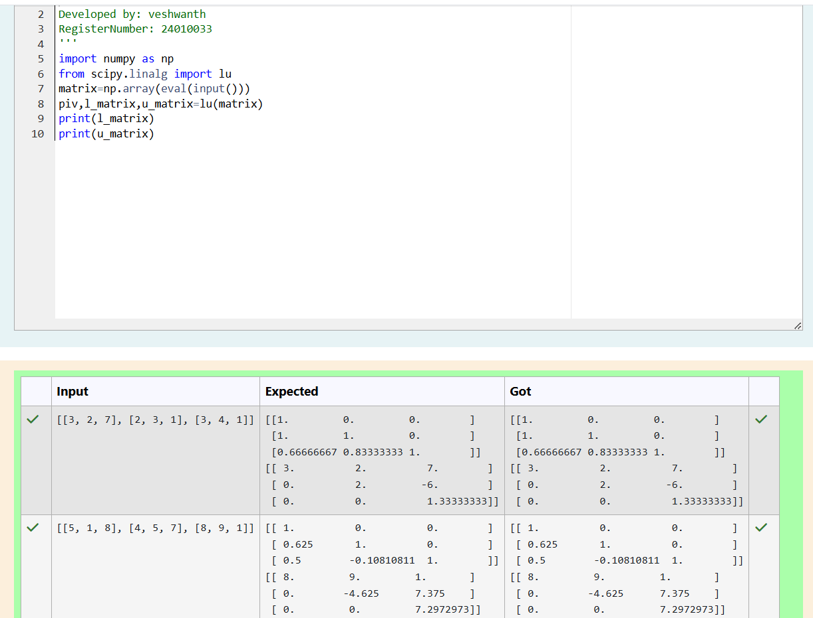
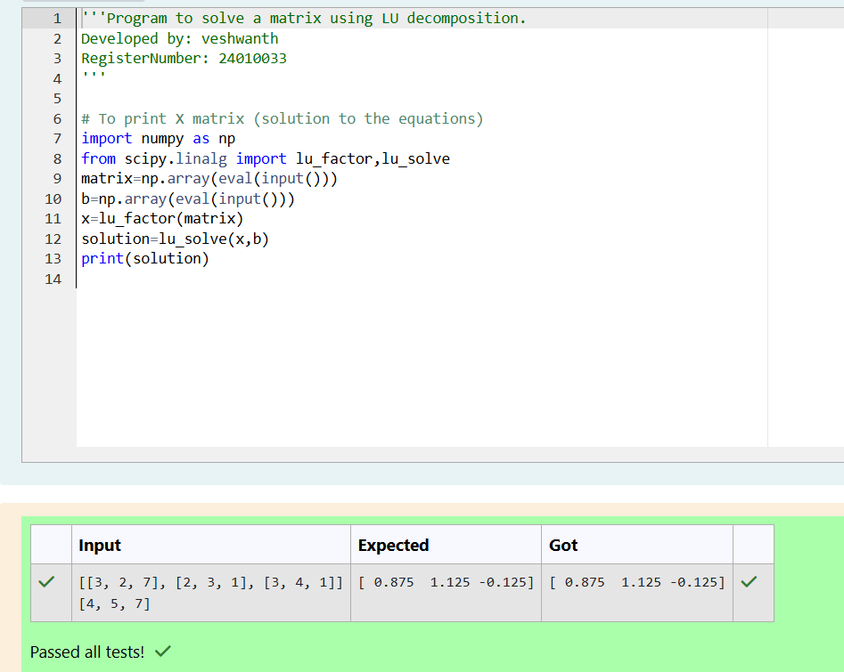

# LU Decomposition 

## AIM:
To write a program to find the LU Decomposition of a matrix.

## Equipments Required:
1. Hardware – PCs
2. Anaconda – Python 3.7 Installation / Moodle-Code Runner

## Algorithm
1. 
2. 
3. 
4. 

## Program:

```
'''Program to find L and U matrix using LU decomposition.
Developed by: veshwanth
RegisterNumber: 24010033
'''
import numpy as np
from scipy.linalg import lu
matrix=np.array(eval(input()))
piv,l_matrix,u_matrix=lu(matrix)
print(l_matrix)
print(u_matrix)

```

use lu decomposition to solve a matrix


```
'''Program to solve a matrix using LU decomposition.
Developed by: veshwanth
RegisterNumber: 24010033
'''

# To print X matrix (solution to the equations)
import numpy as np
from scipy.linalg import lu_factor,lu_solve
matrix=np.array(eval(input()))
b=np.array(eval(input()))
x=lu_factor(matrix)
solution=lu_solve(x,b)
print(solution)

```

## Output:



## Result:
Thus the program to find the LU Decomposition of a matrix is written and verified using python programming.

